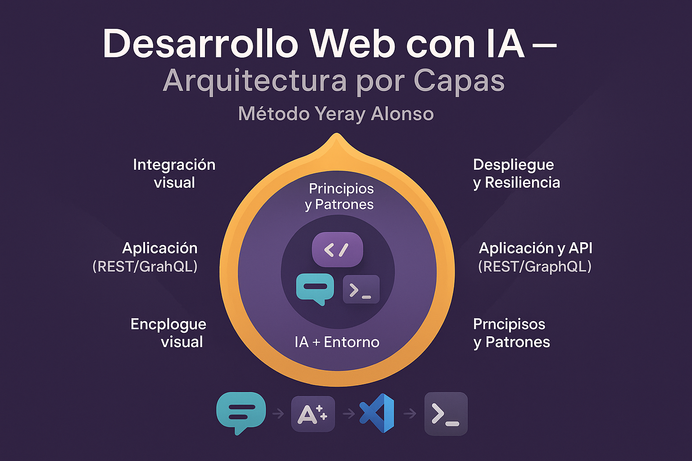

# Curso Vibescoding: Desarrollo Web con IA

  <!-- Reemplaza la ruta cuando agregues tu imagen de portada -->
  

## 🚀 ¿Qué encontrarás en este curso?
Un recorrido paso a paso para crear experiencias web modernas apoyándote en Inteligencia Artificial, explicado en un lenguaje cercano para personas sin formación en ingeniería de software.

- **Aprendizaje por capas:** avanzamos desde una página estática hasta un despliegue robusto en producción.
- **Acompañamiento humano + IA:** combinamos buenas prácticas de desarrollo con herramientas asistidas por IA.
- **Glosarios modulares:** cada módulo incluye definiciones claras para despejar dudas rápidamente.

## 🧭 Mapa del viaje
| Fase | Archivo | Objetivo principal |
|------|---------|-------------------|
| Capa 1 | `Modulo1_WebEstatica_Sin_Dependencias.md` | Diseñar una página estática cuidando la estructura y el contenido accesible. |
| Capa 2 | `Modulo2_Principios_y_Patrones.md` | Adoptar principios de diseño y patrones que hacen que el código sea mantenible. |
| Capa 3 | `Modulo3_Diseno_del_Dominio.md` | Entender el dominio del problema para modelar soluciones coherentes. |
| Capa 4 | `Modulo4_Infraestructura_Reproducible.md` | Construir infraestructuras repetibles que permitan automatizar tareas. |
| Capa 5 | `Modulo5_Aplicacion_y_API.md` | Crear APIs y servicios que conecten las piezas del proyecto. |
| Capa 6 | `Modulo6_Integracion_Visual.md` | Unir backend y frontend en una experiencia visual consistente. |
| Capa 7 | `Modulo7_Despliegue_y_Resiliencia.md` | Desplegar la solución y asegurar su resiliencia en producción. |
| Gran cierre | `Proyecto_Final_Integrador.md` | Integrar todas las capas en un producto final listo para mostrar. |

## 🧠 Cómo sacar el máximo provecho
1. **Lee el glosario de cada módulo** antes de empezar para familiarizarte con la terminología.
2. **Sigue los pasos en orden**: cada capa se apoya en la anterior para evitar saltos bruscos.
3. **Experimenta con IA**: utiliza asistentes para generar código base, validar ideas y automatizar pruebas.
4. **Documenta tu avance**: anota decisiones, aprendizajes y preguntas para compartir con tu comunidad.

## 📸 Recursos visuales
- Guarda tus imágenes de apoyo en la carpeta [`asset/`](asset/) de la raíz del repositorio.
- Actualiza la ruta de la imagen de portada en la sección superior cuando agregues tu archivo.

## 🤝 Contribuye y comparte
¿Tienes mejoras, dudas o experiencias que quieras sumar? Abre un issue o comparte tu fork. Este curso crece con la colaboración de la comunidad Vibescoding.

---
> "Aprender a crear con tecnología es como aprender un nuevo idioma: lo importante es practicar y disfrutar el proceso."
